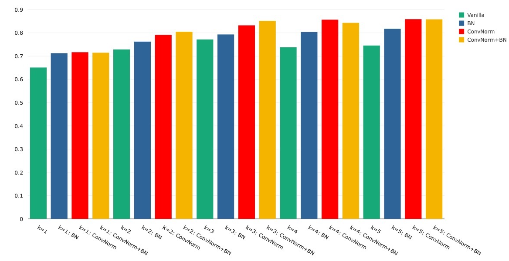

# Adversarial Robustness of Convolutional Networks
This repository contains my mini-project carried out for the *Theories of Deep Learning* course as part of the MSc Mathematical Sciences at the University of Oxford.

The objective of this mini-project was to write a report on a specific subtopic within the area of robustness, including a discussion of some theoretical portion of deep learning along with novel numerical simulations selected to highlight the issue being investigated and a discussion of how the numerical simulations reflect on the issue.
The project was compltetely independent and also had a role-playing element to it.
As such, the report is in the format and style of a Neural Information Processing Systems (NeurIPS) Proceeding but note that the report was not submitted to NeurIPS.

## Abstract
Convolutional Neural Networks (CNNs) have been immensely successful in the past few decades.
In particular, the introduction of Residual Networks (ResNets) was significantly influential.
However, one of the flaws with CNNs is that they are susceptible to adversarial attacks.
It is known that there is a relationship between natural accuracy and robust accuracy.
Furthermore, increasing the width of ResNet is known to increase performance.
After presenting "Convolutional Normalization", we explore the effect of normalization techniques on natural and robust accuracy and investigate their relationship with width for ResNet.

The full report can be found [here](./Adversarial%20Robustness%20of%20Convolutional%20Networks.pdf).

## Introduction
[ConvNorm](https://github.com/shengliu66/ConvNorm) is an efficient normalization technique that improves adversarial robustness against adversarial attacks for convolutional neural networks by exploiting their convolutional structure.
The original work applied the method to generative adversarial networks and ResNet and achieved successful improvements in robustness.
In this work, we extend ConvNorm by adding implementation for the WideResNet architecture and explore the performance by carrying out experiments for various widths of WideResNet-16 on the CIFAR-10 dataset.

## Results
### Test accuracy of WideResNet-16-*k* with various normalization techniques

  
  
  
  
  <figcaption align="center">
    These figures demonstrate several results regarding the width of WideResNet-16, batch normalization (BN), and ConvNorm with respect to natural test accuracy.
    ConvNorm, BN, and their combination improved natural test accuracy across various widths for the architecture.
    Natural test accuracy also tended to improve as the width increased when any combination of the normalization techniques was applied.
  </figcaption>

### Comparison of normalization methods under different adversarial attacks on WideResNet-16-*k*

  
 <figcaption align="center">
  This table shows the results of experiments performed with two methods of adversarial attacks, the Fast Gradient Sign Method (FGSM) and Projected Gradient Descent (PGD), on the WideResNet-16 architecture for varying widths and combinations of normalization methods.
  These attacks test the robustness of the model, with PGD being a stronger type of attack than FGSM.
  Batch normalization on its own consistently improved the models' robustness under both of these attacks, even as the width increased.
  ConvNorm improved robustness under the FGSM attacks and became more effective as the model's width increased.
  For PGD attacks, ConvNorm negatively impacted robustness as the model's width increased beyond $k=2$.
  The combination of batch normalization and ConvNorm particularly improved the robustness against FGSM attacks across widths greater than $k=1$.
  On the other hand, against PGD attacks, the combination became extremely detrimental to robustness for widths beyond $k=1$.
  A strong trend is established between ConvNorm achieving significant improvements against FGSM attacks whilst acquiring major ineffectiveness against PGD attacks as the width of the WideResNet-16 architecture increases.
 </figcaption>

